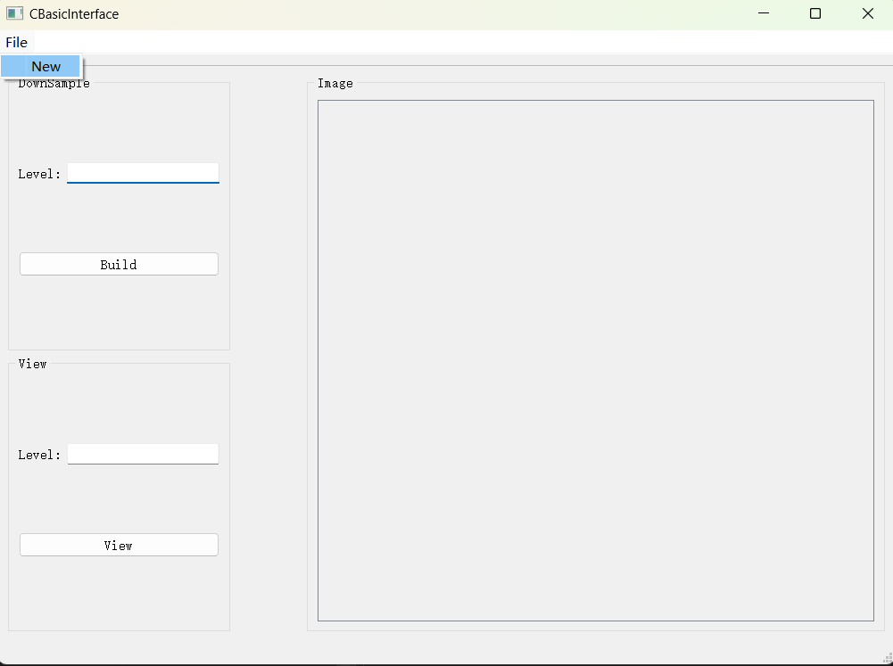
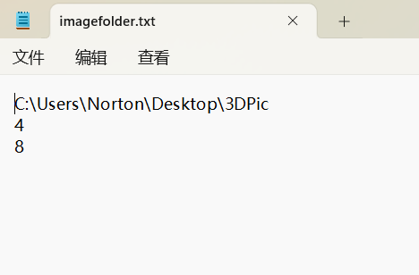
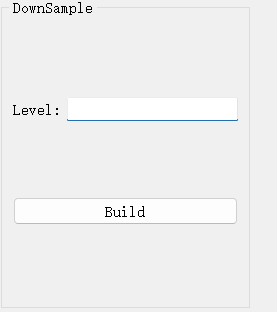
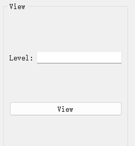

# Map_platform

## 1. 运行程序

## 2. 点击`File`中的`New`按钮，读取一个.txt文件，文件中第一行为图片集的路径，第二行是原始图片集的行数，第三行是列数

## 3. 输入需要构建的层级（输入3则代表点击`build`按钮后会自动构建出第二级和第三级的图片集）

## 4. 输入要查看的层级，点击`View`按钮后可以查看对应层级图片集的第一张图片
